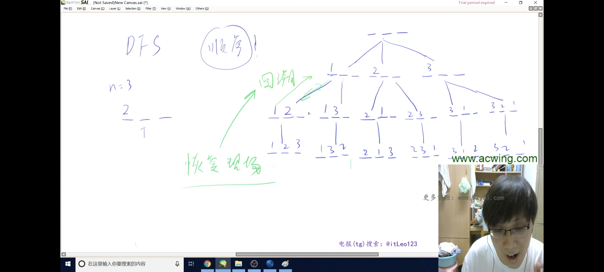
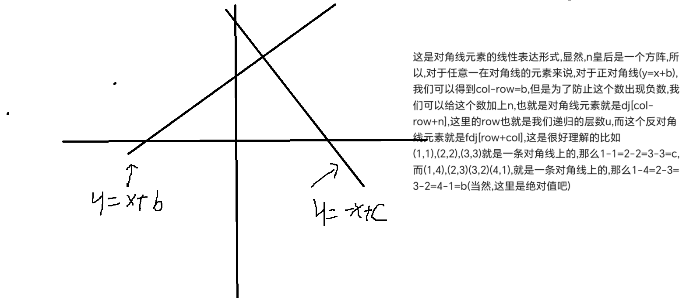

# DFS
1.全排列
2.八皇后

## 全排列
全排列问题，例如3个数：1，2，3
那么全排列就是 
```
1 2 3
1 3 2
2 1 3
2 3 1
3 1 2
3 2 1

```
总共6种方法,这个思路就可以很好用递归来实现,首先回溯三步走


1.base case,终止条件是什么,比如上面的全排列的终止条件是当我们搜索到第三层的时候就终止条件了,然后直接输出我们想要的结果就可以了


2.添加我们想要添加的值,比如在某一层加上数字,或者添上皇后


3.恢复原形,为了回溯当我们递归到base case的时候,这时候已经出来了一种情形,所以在回溯的时候,我们就得把这种情形产生的影响消除

手写一下全排列和n皇后

```
#include<iostream>
using namespace std;
const int N=100;
int arr[N];
bool flag[N];//这个点能用标记为false,不能用标记为true,一开始所有点都是能用的
int n;

void dfs(int u){
    if(u==n){
        //满足我们的要求了,比如n个数的全排列就是搜索到第n层
        for(int i=0;i<n;i++){
            cout<<arr[i];
        }cout<<endl;
        return;
    }

    //1-n的全排列
    for(int i=1;i<=n;i++){
        if(!flag[i]){
            //这个数没有用过
            arr[u]=i;//注意这里是u,而不是i,u表示我们搜索的行数
            flag[i]=true;//被用过了
            dfs(u+1);
            //恢复现场
            flag[i]=false;//恢复到没用过的情况

        }
    }
}

int main(){
    cin>>n;//n个数的全排列
    dfs(0);//dfs的入口
}

```



## n皇后

这个显得就比较复杂一些,我们得用好几个数组来记录状态
```
#include<iostream>
using namespace std;
const int N=100;
//我们用'.'来表示这个为止没有皇后,用'Q'来表示这个位置有皇后
char arr[N][N];
//表示这一列,对角线,反对角线
bool col[N],dj[N],fdj[N];
//为什么不用考虑行呢,这就和上面那个全排列问题一样,因为我们是在每一行进行操作,所以每一行内只会考虑放入一个皇后的问题,所以不用考虑行数组

void dfs(int u){
    if(u==n){
        for(int i=0;i<n;i++){
            puts(arr[i]);
        }cout<<endl;
        return;
    }
    for(int i=0;i<n;i++){
        //关于数组内的下标
        if(!col[i]&&!dj[u-i+n]&&!fdj[u+i]){
            arr[u][i]='Q';
            col[i]=dj[u-i+n]=fdj[u+i]=1;//表示用过了
            dfs(u+1);
            //还原现场
            arr[u][i]='.';
            col[i]=dj[u-i+n]=fdj[u+i]=0;
        }
    }
}

int main(){
    //n代表皇后的个数
    cin>>n;
    for(int i=0;i<n;i++){
    	for(int j=0;j<n;j++){
    		arr[i][j]='.';
		}
	}
    dfs(0);
}

```

## 关于n皇后数组内的下标说明




